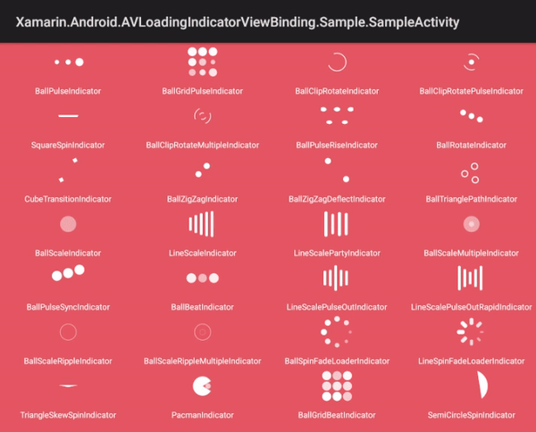
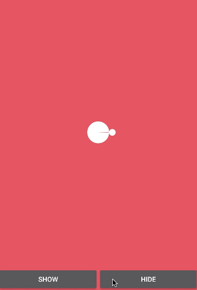

[](https://ci.appveyor.com/project/jzeferino/xamarin-android-avloadingindicatorview)   [](https://www.nuget.org/packages/Xamarin.Android.AVLoadingIndicatorView/)

Xamarin.Android.AVLoadingIndicatorView
===================

This is a Xamarin Android Binding for the [AVLoadingIndicatorView](https://github.com/81813780/AVLoadingIndicatorView).

AVLoadingIndicatorView is a collection of nice loading animations for Android.

## Demo



## Usage
(see the [sample](https://github.com/jzeferino/Xamarin.Android.AVLoadingIndicatorView/tree/master/src/Xamarin.Android.AVLoadingIndicatorViewBinding.Sample) project for a detailed working example)

### Step 1

Instal NuGet [package](https://www.nuget.org/packages/Xamarin.Android.AVLoadingIndicatorView/).

### Step 2

Add the AVLoadingIndicatorView to your layout:

Define xmlns:app in your root view.

```xml
xmlns:app="http://schemas.android.com/apk/res-auto"
```

Simple Loading

```xml
<com.wang.avi.AVLoadingIndicatorView
    android:id="@+id/avi"
    android:layout_width="wrap_content"  
    android:layout_height="wrap_content"
    app:indicatorName="BallPulseIndicator" />
```

Advanced Loading

```xml
<com.wang.avi.AVLoadingIndicatorView
    android:id="@+id/avi"
    android:layout_width="wrap_content"  //or your custom size
    android:layout_height="wrap_content"  //or your custom size
    style="@style/AVLoadingIndicatorView"// or AVLoadingIndicatorView.Large or AVLoadingIndicatorView.Small
    android:visibility="visible"  //visible or gone
    app:indicatorName="BallPulseIndicator"//Indicator Name
    app:indicatorColor="your color" />
```

### Step 3

Show or hide the progress. (start showing by default)
```c#

protected override void OnCreate(Bundle savedInstanceState)
{
    base.OnCreate(savedInstanceState);

    avi = FindViewById<AVLoadingIndicatorView>(Resource.Id.avi);
    avi.Show():
}  

void ShowLoading()
{
    avi.Show();
    // or avi.SmoothToShow();
}

void HideLoading()
{
    avi.Hide();
    // or avi.SmoothToHide();
}
   
```
## Using programmatically

```c#
protected override void OnCreate(Bundle savedInstanceState)
{
    base.OnCreate(savedInstanceState);

    var avLoadingIndicatorView = new AVLoadingIndicatorView(this);
    avLoadingIndicatorView.SetIndicator("SquareSpinIndicator");
    AddContentView(avLoadingIndicatorView, new ViewGroup.LayoutParams(80, 80));
}            
```
## Proguard

When using proguard need add rules:

```
-keep class com.wang.avi.** { *; }
-keep class com.wang.avi.indicators.** { *; }
```

Indicators are loaded from class names, proguard may change it (rename).

## Indicators

As seen above in the **Demo**, the indicators are as follows:

**Row 1**
 * `BallPulseIndicator`
 * `BallGridPulseIndicator`
 * `BallClipRotateIndicator`
 * `BallClipRotatePulseIndicator`

**Row 2**
 * `SquareSpinIndicator`
 * `BallClipRotateMultipleIndicator`
 * `BallPulseRiseIndicator`
 * `BallRotateIndicator`

**Row 3**
 * `CubeTransitionIndicator`
 * `BallZigZagIndicator`
 * `BallZigZagDeflectIndicator`
 * `BallTrianglePathIndicator`

**Row 4**
 * `BallScaleIndicator`
 * `LineScaleIndicator`
 * `LineScalePartyIndicator`
 * `BallScaleMultipleIndicator`

**Row 5**
 * `BallPulseSyncIndicator`
 * `BallBeatIndicator`
 * `LineScalePulseOutIndicator`
 * `LineScalePulseOutRapidIndicator`

**Row 6**
 * `BallScaleRippleIndicator`
 * `BallScaleRippleMultipleIndicator`
 * `BallSpinFadeLoaderIndicator`
 * `LineSpinFadeLoaderIndicator`

**Row 7**
 * `TriangleSkewSpinIndicator`
 * `PacmanIndicator`
 * `BallGridBeatIndicator`
 * `SemiCircleSpinIndicator`
 
### License
[MIT Licence](LICENSE) 
